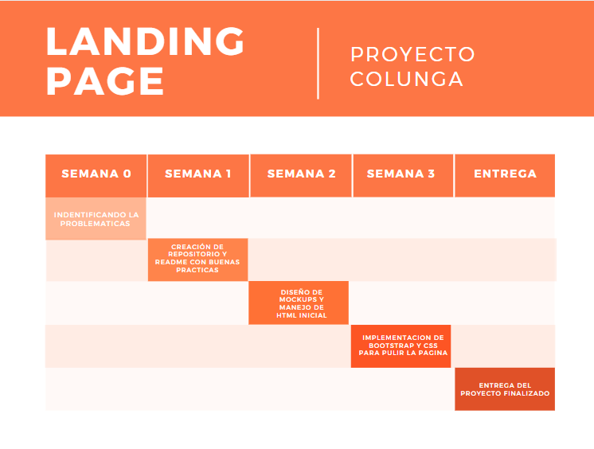

# Tarea1Metodologia
Repositorio Proyecto - Plataforma Colunga
<!--
*** Thanks for checking out the Best-README-Template. If you have a suggestion
*** that would make this better, please fork the repo and create a pull request
*** or simply open an issue with the tag "enhancement".
*** Thanks again! Now go create something AMAZING! :D
***
***
***
*** To avoid retyping too much info. Do a search and replace for the following:
*** github_username, repo_name, twitter_handle, email, project_title, project_description
-->


<!-- PROJECT SHIELDS -->
<!--
*** I'm using markdown "reference style" links for readability.
*** Reference links are enclosed in brackets [ ] instead of parentheses ( ).
*** See the bottom of this document for the declaration of the reference variables
*** for contributors-url, forks-url, etc. This is an optional, concise syntax you may use.
*** https://www.markdownguide.org/basic-syntax/#reference-style-links
-->
[![Contributors][contributors-shield]][contributors-url]
[![Forks][forks-shield]][forks-url]
[![Stargazers][stars-shield]][stars-url]
[![Issues][issues-shield]][issues-url]
[![MIT License][license-shield]][license-url]
[![LinkedIn][linkedin-shield]][linkedin-url]


<!-- PROJECT LOGO -->
<br />
<p align="center">
  <a href="https://github.com/GinoSalazarVillena/Tarea1Metodologia">
    
  </a>

  <h3 align="center">Plataforma Colunga</h3>

  <p align="center">
    Es un proyecto orientado a centralizar la informacion de la organizacion Colunga para sus miembros afiliados.
    <br />
    <a href="https://github.com/GinoSalazarVillena/Tarea1Metodologia"><strong>Explore the docs »</strong></a>
    <br />
    <br />
    <a href="https://github.com/GinoSalazarVillena/Tarea1Metodologia">View Demo</a>
    ·
    <a href="https://github.com/GinoSalazarVillena/Tarea1Metodologia">Report Bug</a>
    ·
    <a href="https://github.com/github_username/repo_name/issues">Request Feature</a>
  </p>
</p>


<!-
<details open="open">
  <summary><h2 style="display: inline-block">Tabla de Contenidos</h2></summary>
  <ol>
    <li>
      <a href="#about-the-project">Acerca del proyecto</a>
      <ul>
        <li><a href="#built-with">Construido con</a></li>
      </ul>
    </li>
    <li>
      <a href="#getting-started">Getting Started</a>
      <ul>
        <li><a href="#prerequisites">Prerequisites</a></li>
        <li><a href="#installation">Installation</a></li>
      </ul>
    </li>
    <li><a href="#usage">Usage</a></li>
    <li><a href="#roadmap">Roadmap</a></li>
    <li><a href="#contributing">Contributing</a></li>
    <li><a href="#license">License</a></li>
    <li><a href="#contact">Contact</a></li>
    <li><a href="#acknowledgements">Acknowledgements</a></li>
  </ol>
</details>


<!-- ABOUT THE PROJECT -->
## Acerca del proyecto
Este proyecto está orientado a centralizar la
comunicación entre miembros de Colunga y las distintas
organizaciones afiliadas. Entregando herramientas de
contacto, de creación y organización de reuniones vía
online y presencial, para compartir los beneficios que
Colunga ofrece a sus miembros


Click izquierdo en la imagen para visitar la pagina
[![Product Name Screen Shot][product-screenshot]](https://www.figma.com/proto/JJj5UJMKXJUJ19EdW5DXix/Untitled?node-id=1%3A2&scaling=min-zoom&page-id=0%3A1)

## Cronograma
<br />
<p align="center">
  <a href="https://github.com/GinoSalazarVillena/Tarea1Metodologia">
    
  </a>
</p>

### Construido con

* [Python](https://www.python.org/)
* [Django](https://www.djangoproject.com)

### Instalacion por consola de django

* django
  ```sh
  pip3 install django
  ```

<!------------------------------------------------------------
### Instalacion
 Clone the repo
   ```sh
   git clone https://github.com/GinoSalazarVillena/Tarea1Metodologia.git
   ```
<!-- GETTING STARTED -->

## Empezando
1. Creando un entorno venv
   ```sh
   python -m venv "myvenv"
   ```
2. Activando entorno en la carpeta clonada https://github.com/GinoSalazarVillena/Tarea1Metodologia.git
   ```sh
   cd "nombreproyecto"
   Scripts\activate.bat
   ```
3. Instalando Django dentro del entorno
   ```sh
    django-admin startproject "nombreproyecto"
   ```
4. Esta listo para poder crear la plantilla de la pagina web

<!-- USAGE EXAMPLES -->
## Usabilidad

Ve como se puede usar nuestro proyecto en un prototipo. [Colunga Figma](https://www.figma.com/proto/JJj5UJMKXJUJ19EdW5DXix/Untitled?node-id=1%3A2&scaling=min-zoom&page-id=0%3A1)


<!-- ROADMAP -->
## Mapa de tiempo

Ve nuestos [issues abiertos](https://github.com/GinoSalazarVillena/Tarea1Metodologia/issues).
Vea nuestros [Propuestas](https://github.com/GinoSalazarVillena/Tarea1Metodologia/projects/1) para una lista de propuestas (y problemas conocidos).

<!-- LICENSE -->
## Licencia

Distribuido con MIT License. Ve `LICENSE` para mas informacion.


<!-- CONTACT -->
## Contacto

Presentación del equipo scrum.
  <ul>
  <li type="disc">PO: Diego Alegría</li>
  <li type="disc">SM: Matías Aravena</li>
  <li type="disc">Gino Salazar</li>
  <li type="disc">Nicolás Salinas</li>
  <li type="disc">Jean Paul Moussiaux</li>
  <li type="disc">Jean Contreras</li>
  <li type="disc">Cristian Millán</li>
  <li type="disc">Alejandro Bórquez</li>
</ul>


Link de proyecto: [https://github.com/GinoSalazarVillena/Tarea1Metodologia](https://github.com/GinoSalazarVillena/Tarea1Metodologia)


<!-- ACKNOWLEDGEMENTS -->
## Agradecimientos

* Agradezco al pana Miguel

<!-- MARKDOWN LINKS & IMAGES -->
<!-- https://www.markdownguide.org/basic-syntax/#reference-style-links -->
[contributors-shield]: https://img.shields.io/github/contributors/GinoSalazarVillena/Tarea1Metodologia.svg?style=for-the-badge
[contributors-url]: https://github.com/GinoSalazarVillena/Tarea1Metodologia/graphs/contributors
[forks-shield]: https://img.shields.io/github/forks/GinoSalazarVillena/Tarea1Metodologia.svg?style=for-the-badge
[forks-url]: https://github.com/GinoSalazarVillena/Tarea1Metodologia/network/members
[stars-shield]: https://img.shields.io/github/stars/GinoSalazarVillena/Tarea1Metodologia.svg?style=for-the-badge
[stars-url]: https://github.com/GinoSalazarVillena/Tarea1Metodologia/stargazers
[issues-shield]: https://img.shields.io/github/issues/GinoSalazarVillena/Tarea1Metodologia.svg?style=for-the-badge
[issues-url]: https://github.com/GinoSalazarVillena/Tarea1Metodologia/issues
[license-shield]: https://img.shields.io/github/license/GinoSalazarVillena/Tarea1Metodologia.svg?style=for-the-badge
[license-url]: https://github.com/GinoSalazarVillena/Tarea1Metodologia/blob/master/LICENSE.txt
[linkedin-shield]: https://img.shields.io/badge/-LinkedIn-black.svg?style=for-the-badge&logo=linkedin&colorB=555
[linkedin-url]: https://linkedin.com/in/GinoSalazarVillena/
[product-screenshot]: images/paginaprincipal.png
